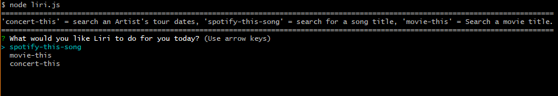
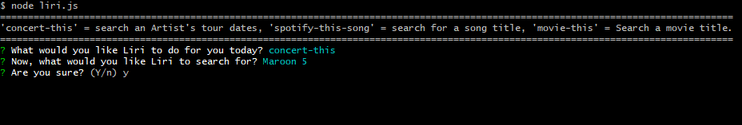
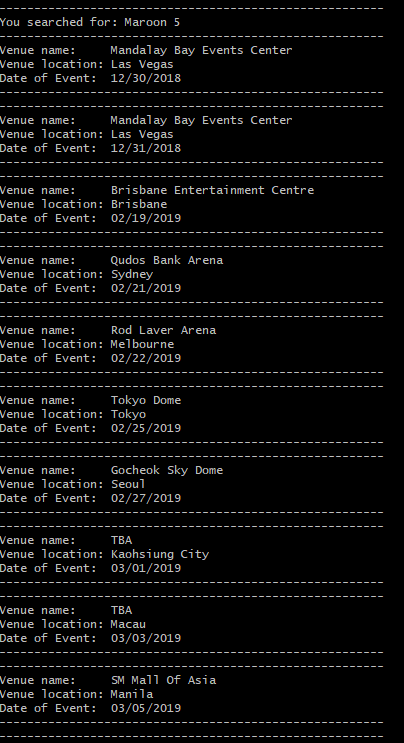
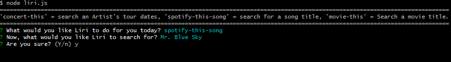
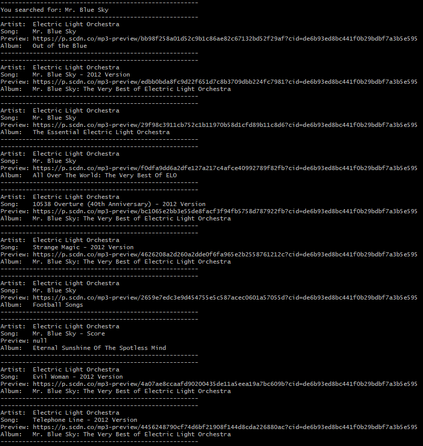
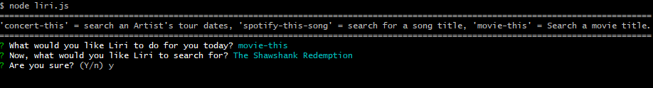
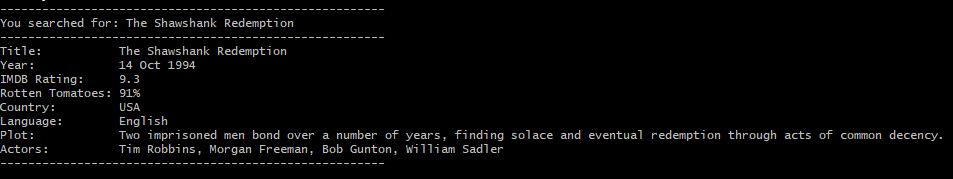
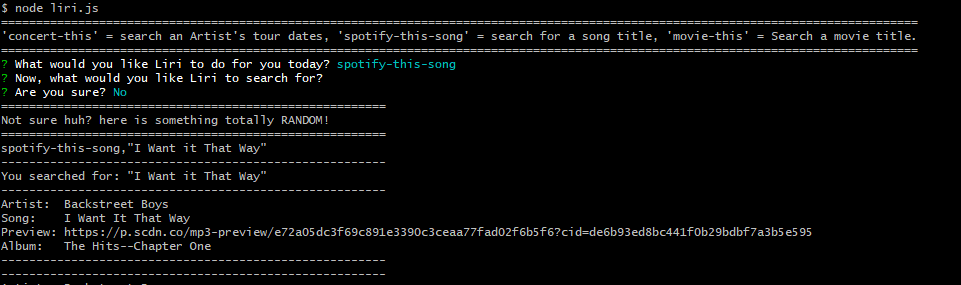
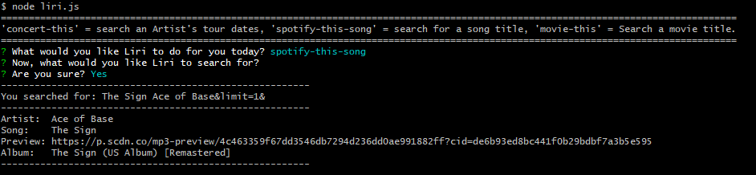

## LIRI - A Command Line Node APP

LIRI is like iPhone's SIRI. However, while SIRI is a Speech Interpretation and Recognition Interface, LIRI is a Language Interpretation and Recognition Interface. LIRI is a command line node app that takes in parameters and gives you back data.

## 

.
[Short Demo Video](https://drive.google.com/file/d/1cKr9XHzt0cYy3stI0elBXkHsC7wV-mrC/view?usp=sharing).

## Usage

1. Clone repo
2. cd to liri-node-app in terminal/bash
3. Install packages in the command line:
 - npm install
 - npm i request
 - npm i node-spotify-api
 - npm i moment
 - npm i dotenv
3. Will need to provide your own keys in a .env file
4. Follow the prompts
5. ENJOY! 

## Tech Used 

* NodeJS
* JavaScript
* Ajax
* NPM Request [Request](https://www.npmjs.com/package/request).
* NPM Inquirer [Inquirer](https://www.npmjs.com/package/twitter).
* NPM Momentjs [Moment](https://www.npmjs.com/package/moment).
* NPM dotenv [dotenv](https://www.npmjs.com/package/dotenv).
* NPM Spotify [Spotify](https://www.npmjs.com/package/spotify).

## APIs Used

* IMDB    [OMDB API](http://www.omdbapi.com).
* BandsInTown    [bandsintown API](http://www.artists.bandsintown.com/bandsintown-api).
* Spotify    [Spotify API](https://developer.spotify.com/documentation/web-api/).

##Notes 

* LIRI will display a prompt asking what you "What would you like Liri to do for you today?"

Liri will work four different ways which can take in one of the following commands:

* `concert-this`

.
.

* `spotify-this-song`

.
.

* `movie-this`

.
.

* `do-what-it-says`

.

* `empty-search`

.

##What Each Command Should Do

node liri.js concert-this `<performing artist>`
* This will show the searched music artist's upcoming events consisiting of:
 - Name of the venue
 - Venue location
 - Date of the Event

node liri.js spotify-this-song `<song name here>`
* This will show the following information about the song in your terminal/bash window: 
 - Artist(s)
 - The song's name
 - A preview link of the song from Spotify
 - The album that the song is from
 * if no song is provided then your program will default to
 * "The Sign" by Ace of Base

node liri.js movie-this `<movie name here>`
* This will output the following information to your terminal/bash window:
 - Title of the movie.
 - Year the movie came out.
 - IMDB Rating of the movie.
 - Rotten Tomatoes Rating.
 - Country where the movie was produced.
 - Language of the movie.
 - Plot of the movie.
 - Actors in the movie.
* If the user doesn't type a movie in, the program will output data for the movie 'Mr. Nobody.'
* If you haven't watched "Mr. Nobody," then you should: http://www.imdb.com/title/tt0485947/
* It's on Netflix!

node liri.js do-what-it-says
* This uses the fs Node package, LIRI will take the text inside of random.txt and then use it to call one of LIRI's commands.